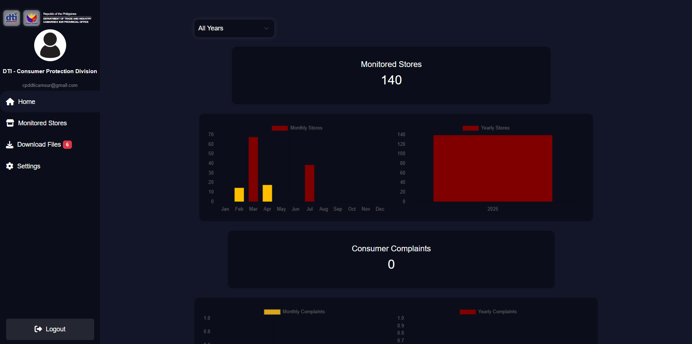
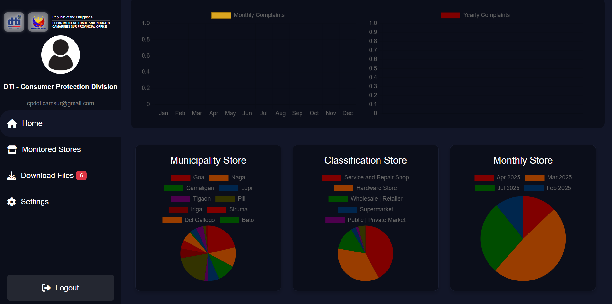
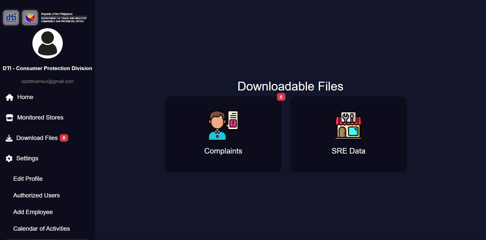

# DTI Admin Dashboard — OJT Project (Showcase)

This repository showcases my **OJT project** for the Department of Trade and Industry (DTI) Admin Dashboard.  
Since the project code was required to be deleted after completion, this repository only contains **screenshots** and a description of the features.

---

## 📸 Screenshots

| Screenshot | Description |
|------------|-------------|
|  | Dashboard with analytics overview (graphs and charts) |
|  | Pie chart and bar chart for data visualization |
|  | Store management table (Read, Update, Delete) |
|  | Complaint & SRE data management section |

---

## 📌 Features

- **Data Analytics**
  - Displays graphs, pie charts, and bar charts for store monitoring data.
- **Store Management**
  - Read, update, and delete store data monitored by DTI.
  - Store data is added via a **mobile application** used by DTI employees on-site.
- **Complaint Management**
  - View and manage complaints submitted from another linked website.
- **SRE Data Access**
  - Retrieve submitted SRE data directly from the shared database.
- **User Management**
  - Manage users who can access the Admin Dashboard.
- **Restricted Access**
  - Only allows Read, Update, and Delete actions for stores; adding new stores is handled via the mobile application.

---

## 🛠 Tools & Technologies Used

- **Frontend**
  - HTML
  - CSS with Bootstrap
  - JavaScript

- **Backend & Database**
  - Firebase (Firestore Database)

- **Deployment & Version Control**
  - Firebase Hosting
  - Git & GitHub for collaborative work

---

## 📂 Repository Contents
- `screenshots/` — Folder containing all project screenshots.
- `README.md` — Project description and showcase (this file).

---

## 📄 Note
This repository is for **portfolio purposes only** and does not contain any source code due to OJT confidentiality requirements.
